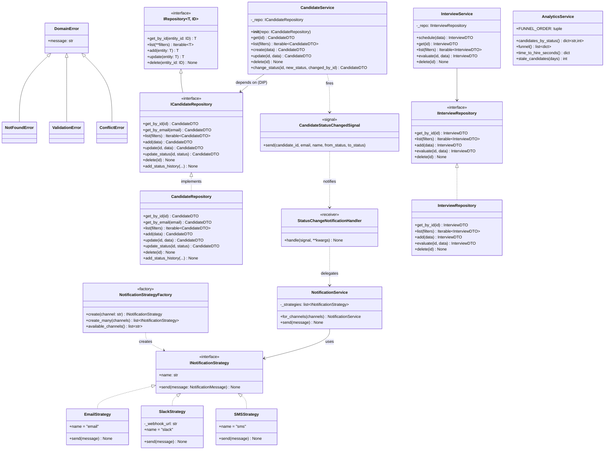

# Class Diagram — HR Candidate Evaluation System

## Повна діаграма класів (архітектурні шари)



---

## Dependency Injection Flow

```
DRF View
  │
  ├─ get_candidate_service()        ← factory.py
  │      └─ CandidateService(repo=CandidateRepository())
  │                                         │
  │                              ICandidateRepository
  │                                         │
  │                              CandidateRepository  ← Django ORM
  │
  └─ Test: CandidateService(repo=InMemoryCandidateRepo())
                                     InMemoryCandidateRepo  ← dict
```
