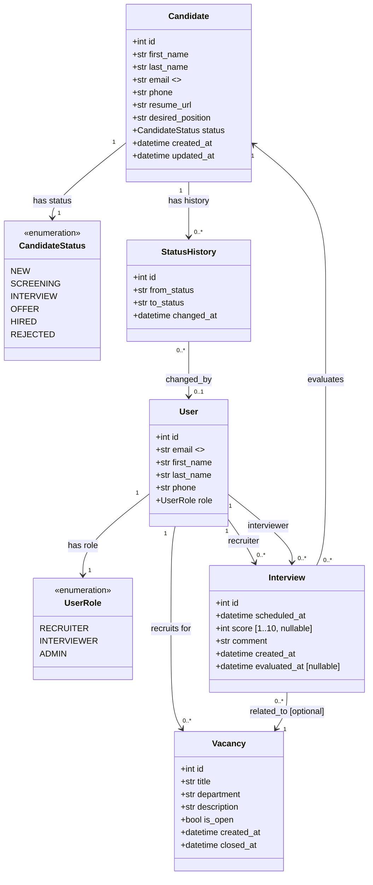
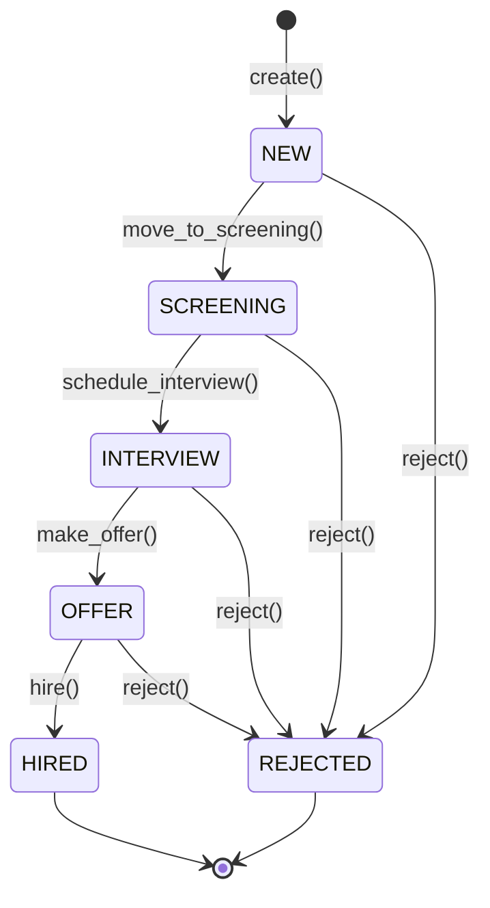

# Domain Model — HR Candidate Evaluation System

## Модель предметної області

---

## Стейт-машина кандидата

### Дозволені переходи (ALLOWED_TRANSITIONS)

| Від | До |
|-----|----|
| `NEW` | `SCREENING`, `REJECTED` |
| `SCREENING` | `INTERVIEW`, `REJECTED` |
| `INTERVIEW` | `OFFER`, `REJECTED` |
| `OFFER` | `HIRED`, `REJECTED` |
| `HIRED` | — (термінальний) |
| `REJECTED` | — (термінальний) |

---

## Бізнес-правила

1. **Унікальний email** — конфлікт при спробі створити дублікат
2. **Суворі переходи статусів** — тільки по дозволених ребрах графу
3. **Аудит** — кожна зміна статусу записується в `StatusHistory`
4. **Нотифікація** — при кожній зміні статусу Celery відправляє повідомлення
5. **RBAC** — Recruiter/Admin: повний доступ; Interviewer: читання + оцінка
6. **Score** — оцінка 1-10, виставляється лише Interviewer
7. **Термінальні статуси** — HIRED і REJECTED незмінні
