# Use Case Diagram — HR Candidate Evaluation System

```mermaid
graph TB
    subgraph Actors
        R[👤 Recruiter]
        I[👤 Interviewer]
        A[👤 Admin]
        S[🤖 System/Celery]
    end

    subgraph Candidates Management
        UC1[Register Candidate]
        UC2[View Candidate List]
        UC3[Update Candidate Info]
        UC4[Delete Candidate]
        UC5[Change Candidate Status]
        UC6[View Status History]
    end

    subgraph Vacancy Management
        UC7[Create Vacancy]
        UC8[View Vacancies]
        UC9[Close Vacancy]
        UC10[Delete Vacancy]
    end

    subgraph Interview Management
        UC11[Schedule Interview]
        UC12[View Interviews]
        UC13[Evaluate Interview]
        UC14[Delete Interview]
    end

    subgraph Analytics
        UC15[View Funnel Report]
        UC16[View Time-to-Hire]
        UC17[View Candidates by Status]
    end

    subgraph Notifications
        UC18[Send Status Change Notification]
    end

    R --> UC1
    R --> UC2
    I --> UC2
    R --> UC3
    R --> UC4
    R --> UC5
    R --> UC6
    I --> UC6

    R --> UC7
    R --> UC8
    I --> UC8
    R --> UC9
    R --> UC10

    R --> UC11
    R --> UC12
    I --> UC12
    I --> UC13
    R --> UC14

    R --> UC15
    I --> UC15
    R --> UC16
    R --> UC17

    UC5 -->|triggers| UC18
    S --> UC18

    A --> UC1
    A --> UC3
    A --> UC4
    A --> UC5
    A --> UC7
    A --> UC9
    A --> UC11
```

## Ключові сценарії (Use Cases)

### UC1: Реєстрація кандидата (Register Candidate)
**Актор:** Recruiter / Admin  
**Передумова:** Кандидат не існує в системі  
**Основний потік:**
1. Recruiter надсилає POST /api/v1/candidates/ з ім'ям, email, телефоном
2. Система перевіряє унікальність email (case-insensitive)
3. Система створює кандидата зі статусом NEW
4. Повертає 201 з ID та даними кандидата

**Альтернативний потік (дублікат email):** 409 Conflict

---

### UC2: Зміна статусу кандидата (Change Candidate Status)
**Актор:** Recruiter / Admin  
**Передумова:** Кандидат існує, не у термінальному статусі  
**Основний потік:**
1. PATCH /api/v1/candidates/{id}/status/ з новим статусом
2. Система перевіряє допустимість переходу (ALLOWED_TRANSITIONS)
3. Оновлює статус, записує в StatusHistory
4. Надсилає сигнал → Celery відправляє email-нотифікацію
5. Повертає 200 з оновленим кандидатом

**Альтернативний потік (заборонений перехід):** 400 ValidationError

---

### UC3: Планування інтерв'ю (Schedule Interview)
**Актор:** Recruiter  
**Передумова:** Кандидат існує, Interviewer існує  
**Основний потік:**
1. POST /api/v1/interviews/ з candidate_id, interviewer_id, scheduled_at
2. Система призначає recruiter_id з JWT токена
3. Створює Interview зі score=null
4. Повертає 201

---

### UC4: Оцінка інтерв'ю (Evaluate Interview)
**Актор:** Interviewer  
**Передумова:** Interview існує, оцінка ще не виставлена  
**Основний потік:**
1. PATCH /api/v1/interviews/{id}/evaluate/ з score (1-10) та comment
2. Система валідує score в межах 1-10
3. Записує evaluated_at
4. Повертає 200 з оновленим Interview

**Альтернативний потік (score out of range):** 400

---

### UC5: Аналітика воронки (View Funnel Report)
**Актор:** Recruiter / Interviewer / Admin  
**Основний потік:**
1. GET /api/v1/analytics/funnel/
2. Система підраховує кількість кандидатів на кожному етапі
3. Обчислює % конверсії між етапами
4. Повертає список: [{status, count, conversion_from_prev_pct}]

---

### UC6: Блокування прийнятого/відхиленого кандидата (Terminal Status)
**Актор:** Recruiter  
**Передумова:** Кандидат у статусі HIRED або REJECTED  
**Основний потік:**
1. PATCH /api/v1/candidates/{id}/status/ з будь-яким статусом
2. Система визначає термінальний стан
3. Повертає 400 ValidationError "Transition not allowed"

---

### UC7: Закриття вакансії (Close Vacancy)
**Актор:** Recruiter / Admin  
**Передумова:** Вакансія існує та is_open=True  
**Основний потік:**
1. POST /api/v1/vacancies/{id}/close/
2. Система встановлює is_open=False, closed_at=now()
3. Ідемпотентна операція (повторний виклик → 200)
4. Повертає оновлену вакансію
